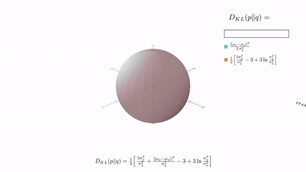
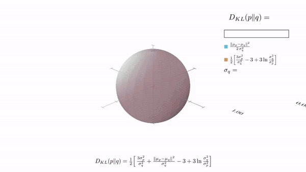
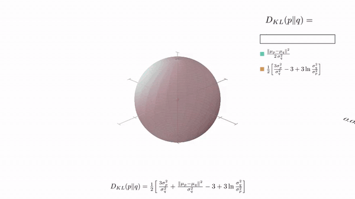

# KL Divergence in 3D

Three short [Manim](https://www.manim.community/) animations showing how
$D_{KL}(p\,\|\,q)$ between two isotropic 3D Gaussians changes as their
parameters vary. Each scene splits $D_{KL}$ into a **teal** translation term
$\frac{\|\mu_p-\mu_q\|^2}{2\sigma_q^2}$ and a **gold** scale term
$\frac{1}{2}[\frac{3\sigma_p^2}{\sigma_q^2} - 3 + 3\ln\frac{\sigma_q^2}{\sigma_p^2}]$,
visualized as a stacked bar.

### Translate $\mu_q$



### Scale $\sigma_q$



### Both together



> The `.mp4` originals (sharper, smaller) are next to the gifs:
> [Translation](videos/KLTranslation.mp4) ·
> [Scaling](videos/KLScaling.mp4) ·
> [Combined](videos/KLCombined.mp4).

## Render

Needs [`pixi`](https://pixi.sh) and a system LaTeX with `standalone.cls`
(e.g. `texlive-latex-extra cm-super dvisvgm` on Debian).

```bash
pixi install
pixi run render        # 480p15 → media/videos/kl_3d/480p15/
pixi run render-hq     # 1080p60 → media/videos/kl_3d/1080p60/
```

The previews in [`videos/`](videos/) are the committed 480p15 outputs.

## License

[MIT](LICENSE).
